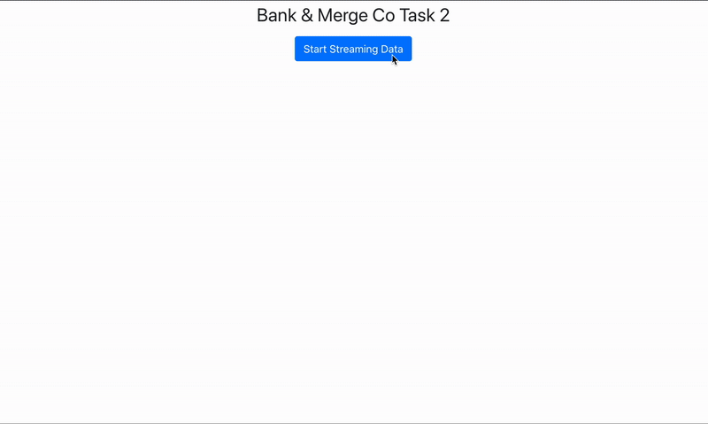

# JPMC Software Engineering Virtual Experience – Task 2

This task is part of JPMorgan Chase's Software Engineering Virtual Experience on Forage. It builds directly on Task 1 by introducing a React + TypeScript frontend and focuses on integrating JPMorgan's internal tools and frameworks to visualize real-time market data.

---

## 💡 Project Overview

The goal of Task 2 is to prepare a modern web interface that displays bid/ask market data for two fictional stocks (`ABC` and `DEF`) fetched from a Python backend server. It introduces JPMorgan’s open-source frameworks and encourages clean frontend integration practices.

---

## 🧠 My Contributions

- Set up and connected a TypeScript + React frontend to the existing Python backend from Task 1 to dynamically display stock data.
- Integrated REST API calls to the `/query` endpoint and displayed data dynamically in the browser.
- Verified that the full-stack flow from synthetic data generation to frontend display is functional.

---

## 🛠️ Technologies Used

- 🐍 Python 3 (data feed server)
- ⚛️ React + TypeScript (frontend interface)
- 📦 npm + Node.js
- 💡 HTML, CSS, JS

---

## 🚀 How to Run the Project Locally

### 1. Start the Python Backend

```bash
# Create and activate virtual environment
python3 -m venv venv
source venv/bin/activate  # On macOS/Linux
# OR
venv\Scripts\activate   # On Windows

# Install dependencies and start server
pip install -r requirements.txt
python3 server3.py
```

By default, the backend will run at: `http://localhost:8080`

---

### 2. Start the React Frontend

```bash
# Make sure you're in the project root with package.json
npm install
npm start
```

This will launch the app at: `http://localhost:3000`

---

## 🖼️ What to Expect

- 📷 **Live UI Example**
  

---

## 📌 Notes

- Task 2 builds directly on Task 1’s backend.
- The original simulation was hosted on Forage but has since been archived.
- This repo reflects my cleaned, updated, and working implementation with frontend integration.

---

## 💭 Reflection

This task deepened my understanding of API-driven frontend development and how financial data pipelines can be visualized. It also helped me bridge Python-based backends with modern web technologies in a clean and accessible way.
