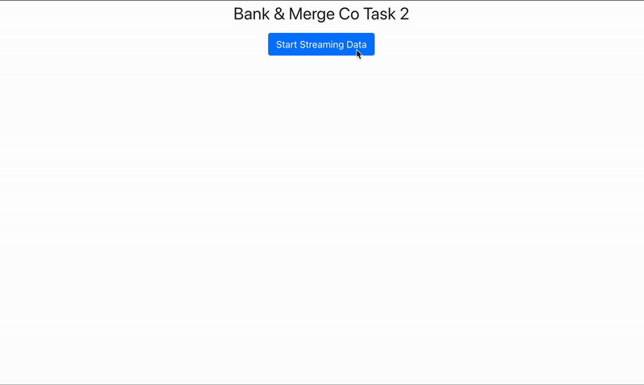

# Task 2: Perspective integration

[← Software Engineering (Perspective)](https://github.com/dhu2022-dev/job-simulations/blob/main/jpmc/swe-perspective/README.md)

[← Task 1](https://github.com/dhu2022-dev/jpmc-swe-task1) | [Task 3 →](https://github.com/dhu2022-dev/jpmc-swe-task3)

Task 2 from the JPMC Software Engineering (Perspective) job sim. React + TypeScript frontend with [Perspective](https://perspective.finos.org/), fed by the Task 1 Python server. Polls `/query` every 100ms and shows a line chart of ask prices.

## How to run

### Backend

```bash
python3 -m venv venv
source venv/bin/activate  # macOS/Linux
# OR: venv\Scripts\activate  # Windows

pip install -r datafeed/requirements.txt
python3 datafeed/server3.py
```

Backend runs at `http://localhost:8080`.

### Frontend (separate terminal)

```bash
npm install
npm start
```

App runs at `http://localhost:3000`.

## Demo


